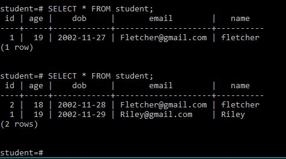

# student-spring-boot
Java program that will connect to a database and perform CRUD operations

Uses Spring Boot and a PostgreSQL database to create student objects which can be altered, removed, created, and read
